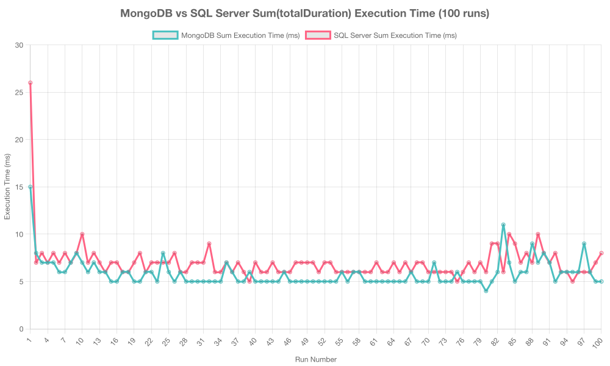
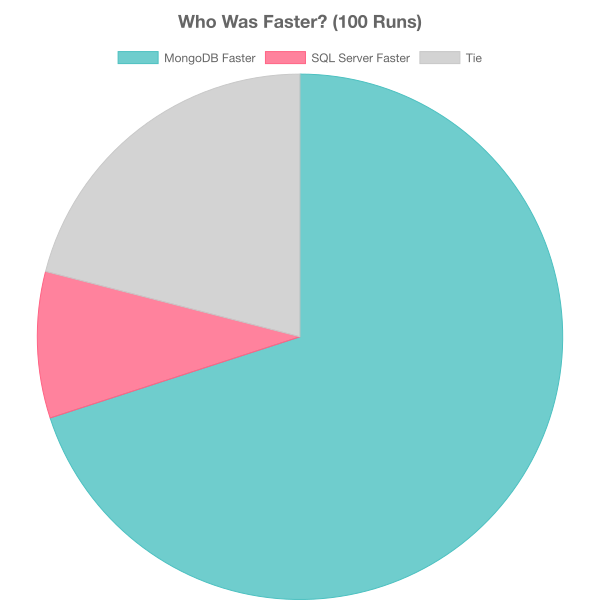

# BenchmarkSQL for MongoDB 8.0

Benchmark for MongoDB 8.0 and SQL Express 2022 for specific operation of SUM vs $group of 30.000 data. The code will summarise the totalDuration fields and column

## Overview

This is node js code that would run 100 times benchmark to get the execution times and map the graph in two image format line chart and pie chart 

## Prerequisites

- Node.js 14 or higher
- Docker
- npm or yarn

## Getting Started

### Installation

1. Clone the repository:
    ```
    git clone https://github.com/yourusername/benchmarksqlmongo.git
    cd benchmarksqlmongo
    ```

2. Install dependencies:
    ```
    npm install
    ```

2. Docker compose up:
    ```
    docker-compose.yaml
    ```


### Running the Benchmark

1. To populate the 30.000 data on both SQL and MongoDB:
    ```
    node index.js
    ```

1. Clone the repository:
    ```
    node graphbenchmark.js
    ```

### The code between SQL and MongoDB
### SQL (MSSQL) Implementation

```javascript
// SQL Server Query for SUM operation
async function runSqlSum() {
    try {
        await sql.connect(sqlConfig);
        const startTime = performance.now();
        
        // Executing SUM query
        const result = await sql.query`
            SELECT SUM(totalDuration) AS total
            FROM timeEntries
        `;
        
        const endTime = performance.now();
        await sql.close();
        return endTime - startTime;
    } catch (err) {
        console.error('SQL error:', err);
        return 0;
    }
}
```

### MongoDB Implementation

```javascript
// MongoDB Query for $group operation
async function runMongoSum() {
    try {
        const client = await MongoClient.connect(mongoUrl);
        const db = client.db('timetracker');
        const collection = db.collection('timeEntries');
        
        const startTime = performance.now();
        
        // Executing $group aggregation
        const result = await collection.aggregate([
            {
                $group: {
                    _id: null,
                    total: { $sum: "$totalDuration" }
                }
            }
        ]).toArray();
        
        const endTime = performance.now();
        await client.close();
        return endTime - startTime;
    } catch (err) {
        console.error('MongoDB error:', err);
        return 0;
    }
}
```

### Performance Comparison

The benchmark results demonstrate that MongoDB performs faster than SQL Express for the specific SUM vs $group operation on 30,000 records.



*Figure 1: Execution time comparison between MongoDB and SQL Express across multiple runs*



*Figure 2: Percentage distribution of execution time between MongoDB and SQL Express*

As shown in the charts above, MongoDB consistently outperforms SQL Express in the aggregation operations tested.

## Contributing

Contributions are welcome! Please feel free to submit a Pull Request.

## License

This project is licensed under the Apache License 2.0 - see the LICENSE file for details.


